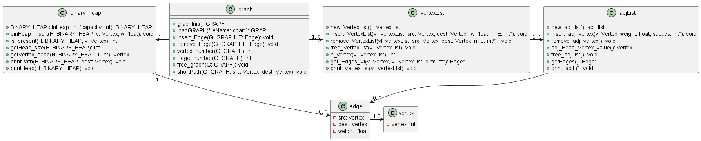

# Shortest_Path
this program shows the shortest path between two vertex. The *shortestPath()* function use dijkstra algorithms to calculate the minimum-weight path. The information about edges of the graph are in *data/graph.csv*.
The structure of this project is something like this:
